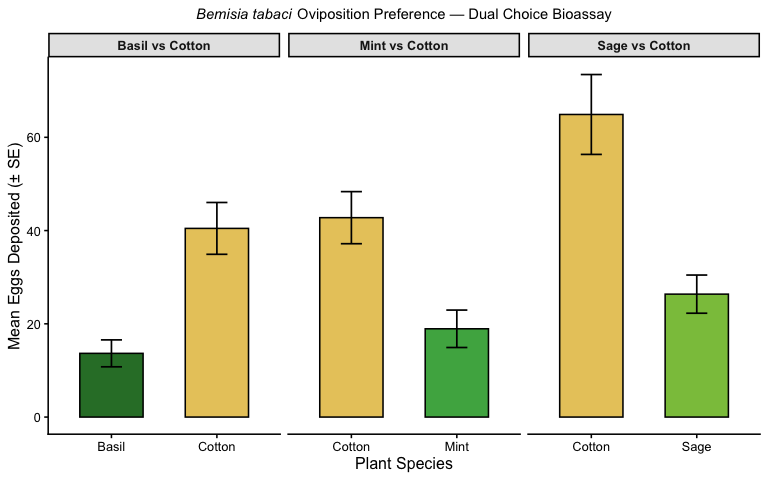
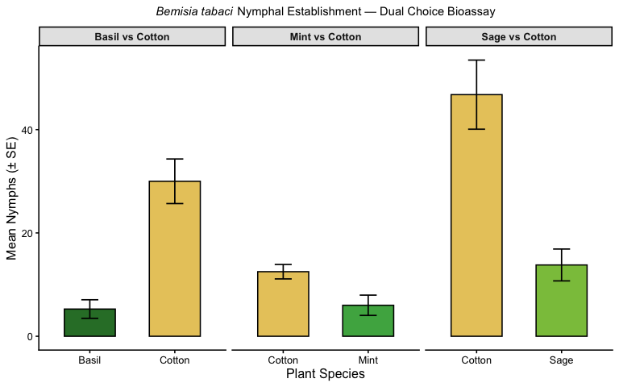
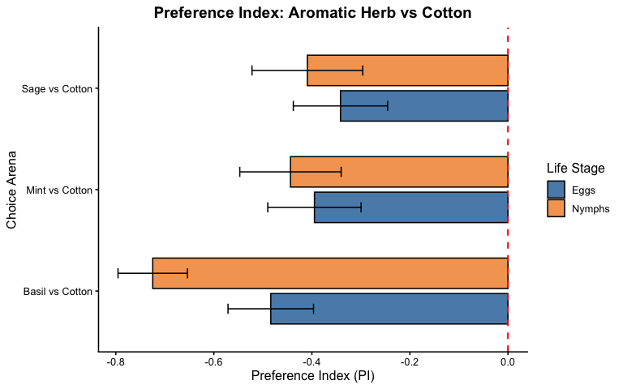

------------------------------------------------------------------------

# Overview

This analysis examines the host preference of *Bemisia tabaci*
(sweetpotato whitefly) in dual-choice bioassays comparing aromatic herb
companions (Mint, Sage, Basil) against Cotton as the primary host. Eggs
and nymphs deposited on each plant type serve as proxies for oviposition
preference and nymphal establishment, respectively.

Three separate choice arenas were tested:

- **Arena 1:** Mint vs. Cotton  
- **Arena 2:** Sage vs. Cotton  
- **Arena 3:** Basil vs. Cotton

------------------------------------------------------------------------

# Load and Reshape Data

``` r
raw <- read_csv("Project_data.csv")
head(raw)
```

    ## # A tibble: 6 × 12
    ##   Replication Plant   Eggs Nymph Replication.1 Plant.1 Eggs.1 Nymph.1
    ##         <dbl> <chr>  <dbl> <dbl>         <dbl> <chr>    <dbl>   <dbl>
    ## 1           1 Mint      99    52             1 Sage        33       7
    ## 2           1 Cotton    58    14             1 Cotton      40      31
    ## 3           2 Mint      10     5             2 Sage        17       2
    ## 4           2 Cotton    27    10             2 Cotton      98      77
    ## 5           3 Mint      25     0             3 Sage        25      10
    ## 6           3 Cotton    54     5             3 Cotton     212     160
    ## # ℹ 4 more variables: Replication.2 <dbl>, Plant.2 <chr>, Eggs.2 <dbl>,
    ## #   Nymph.2 <dbl>

``` r
names(raw)
```

    ##  [1] "Replication"   "Plant"         "Eggs"          "Nymph"        
    ##  [5] "Replication.1" "Plant.1"       "Eggs.1"        "Nymph.1"      
    ##  [9] "Replication.2" "Plant.2"       "Eggs.2"        "Nymph.2"

``` r
find("select")
```

    ## [1] "package:MASS"  "package:dplyr"

``` r
# Arena 1: Mint vs Cotton
arena1 <- raw %>%
  dplyr::select(Replication, Plant, Eggs, Nymph) %>%
  mutate(Arena = "Mint vs Cotton")

# Arena 2: Sage vs Cotton
arena2 <- raw %>%
  dplyr::select(Replication = Replication.1, Plant = Plant.1,
         Eggs = Eggs.1, Nymph = Nymph.1) %>%
  mutate(Arena = "Sage vs Cotton")

# Arena 3: Basil vs Cotton
arena3 <- raw %>%
 dplyr::select(Replication = Replication.2, Plant = Plant.2,
         Eggs = Eggs.2, Nymph = Nymph.2) %>%
  mutate(Arena = "Basil vs Cotton")

# Combine all arenas
df <- rbind(arena1, arena2, arena3) %>%
  mutate(
    Plant       = as.factor(Plant),
    Arena       = as.factor(Arena),
    Replication = as.factor(Replication)
  )

head(df)
```

    ## # A tibble: 6 × 5
    ##   Replication Plant   Eggs Nymph Arena         
    ##   <fct>       <fct>  <dbl> <dbl> <fct>         
    ## 1 1           Mint      99    52 Mint vs Cotton
    ## 2 1           Cotton    58    14 Mint vs Cotton
    ## 3 2           Mint      10     5 Mint vs Cotton
    ## 4 2           Cotton    27    10 Mint vs Cotton
    ## 5 3           Mint      25     0 Mint vs Cotton
    ## 6 3           Cotton    54     5 Mint vs Cotton

``` r
glimpse(df)
```

    ## Rows: 180
    ## Columns: 5
    ## $ Replication <fct> 1, 1, 2, 2, 3, 3, 4, 4, 5, 5, 6, 6, 7, 7, 8, 8, 9, 9, 10, …
    ## $ Plant       <fct> Mint, Cotton, Mint, Cotton, Mint, Cotton, Mint, Cotton, Mi…
    ## $ Eggs        <dbl> 99, 58, 10, 27, 25, 54, 23, 64, 2, 35, 18, 51, 0, 62, 10, …
    ## $ Nymph       <dbl> 52, 14, 5, 10, 0, 5, 2, 14, 1, 19, 7, 18, 0, 36, 0, 7, 3, …
    ## $ Arena       <fct> Mint vs Cotton, Mint vs Cotton, Mint vs Cotton, Mint vs Co…

------------------------------------------------------------------------

# Summary Statistics

``` r
summary_stats <- df %>%
  group_by(Arena, Plant) %>%
  summarise(
    n          = n(),
    mean_eggs  = mean(Eggs,  na.rm = TRUE),
    sd_eggs    = sd(Eggs,    na.rm = TRUE),
    se_eggs    = sd_eggs / sqrt(n),
    mean_nymph = mean(Nymph, na.rm = TRUE),
    sd_nymph   = sd(Nymph,   na.rm = TRUE),
    se_nymph   = sd_nymph / sqrt(n),
    .groups    = "drop"
  )

knitr::kable(summary_stats, digits = 2,
             caption = "Summary statistics: Mean eggs and nymphs per plant type per arena")
```

| Arena | Plant | n | mean_eggs | sd_eggs | se_eggs | mean_nymph | sd_nymph | se_nymph |
|:---|:---|---:|---:|---:|---:|---:|---:|---:|
| Basil vs Cotton | Basil | 30 | 13.67 | 15.82 | 2.89 | 5.27 | 9.85 | 1.80 |
| Basil vs Cotton | Cotton | 30 | 40.47 | 30.44 | 5.56 | 30.00 | 23.63 | 4.31 |
| Mint vs Cotton | Cotton | 30 | 42.77 | 30.60 | 5.59 | 12.50 | 7.66 | 1.40 |
| Mint vs Cotton | Mint | 30 | 18.93 | 21.99 | 4.01 | 6.00 | 10.75 | 1.96 |
| Sage vs Cotton | Cotton | 30 | 64.90 | 46.92 | 8.57 | 46.77 | 36.63 | 6.69 |
| Sage vs Cotton | Sage | 30 | 26.37 | 22.42 | 4.09 | 13.80 | 16.89 | 3.08 |

Summary statistics: Mean eggs and nymphs per plant type per arena

------------------------------------------------------------------------

# Preference Index (PI)

The Preference Index quantifies the relative attractiveness of each
plant in a dual-choice arena:

``` math
PI = \frac{N_{herb} - N_{cotton}}{N_{herb} + N_{cotton}}
```

PI \> 0: preference for herb; PI \< 0: preference for Cotton; PI = 0: no
preference.

``` r
pi_data <- df %>%
  group_by(Arena, Replication, Plant) %>%
  summarise(Eggs = sum(Eggs), Nymph = sum(Nymph), .groups = "drop") %>%
  pivot_wider(names_from = Plant, values_from = c(Eggs, Nymph)) %>%
  mutate(
    herb_eggs = case_when(
      Arena == "Mint vs Cotton" ~ Eggs_Mint,
      Arena == "Sage vs Cotton" ~ Eggs_Sage,
      Arena == "Basil vs Cotton" ~ Eggs_Basil
    ),
    herb_nymph = case_when(
      Arena == "Mint vs Cotton" ~ Nymph_Mint,
      Arena == "Sage vs Cotton" ~ Nymph_Sage,
      Arena == "Basil vs Cotton" ~ Nymph_Basil
    )
  )


# Compute PI per arena dynamically
pi_calc <- df %>%
  group_by(Arena, Replication) %>%
  summarise(
    herb_plant  = Plant[Plant != "Cotton"][1],
    herb_eggs   = Eggs[Plant != "Cotton"],
    cotton_eggs = Eggs[Plant == "Cotton"],
    herb_nymph  = Nymph[Plant != "Cotton"],
    cotton_nymph = Nymph[Plant == "Cotton"],
    .groups = "drop"
  ) %>%
  mutate(
    PI_eggs  = (herb_eggs  - cotton_eggs)  / (herb_eggs  + cotton_eggs  + 1e-6),
    PI_nymph = (herb_nymph - cotton_nymph) / (herb_nymph + cotton_nymph + 1e-6)
  )

pi_summary <- pi_calc %>%
  group_by(Arena, herb_plant) %>%
  summarise(
    mean_PI_eggs  = mean(PI_eggs,  na.rm = TRUE),
    se_PI_eggs    = sd(PI_eggs,    na.rm = TRUE) / sqrt(n()),
    mean_PI_nymph = mean(PI_nymph, na.rm = TRUE),
    se_PI_nymph   = sd(PI_nymph,   na.rm = TRUE) / sqrt(n()),
    .groups = "drop"
  )

knitr::kable(pi_summary, digits = 3,
             caption = "Preference Index (PI): negative = preference for Cotton")
```

| Arena           | herb_plant | mean_PI_eggs | se_PI_eggs | mean_PI_nymph | se_PI_nymph |
|:----------------|:-----------|-------------:|-----------:|--------------:|------------:|
| Basil vs Cotton | Basil      |       -0.484 |      0.087 |        -0.725 |       0.071 |
| Mint vs Cotton  | Mint       |       -0.395 |      0.095 |        -0.444 |       0.103 |
| Sage vs Cotton  | Sage       |       -0.342 |      0.096 |        -0.409 |       0.113 |

Preference Index (PI): negative = preference for Cotton

------------------------------------------------------------------------

# Figures

## Figure 1 — Mean Eggs Deposited per Plant Type per Arena

``` r
egg_plot <- ggplot(summary_stats,
       aes(x = Plant, y = mean_eggs, fill = Plant)) +
  geom_col(color = "black", width = 0.6) +
  geom_errorbar(aes(ymin = mean_eggs - se_eggs,
                    ymax = mean_eggs + se_eggs),
                width = 0.2, linewidth = 0.6) +
  facet_wrap(~ Arena, scales = "free_x") +
  scale_fill_manual(values = c(
    "Mint"   = "#4CAF50",
    "Sage"   = "#8BC34A",
    "Basil"  = "#2E7D32",
    "Cotton" = "#E8C96A"
  )) +
  labs(
    title    = expression(paste(italic("Bemisia tabaci"), " Oviposition Preference — Dual Choice Bioassay")),
    x        = "Plant Species",
    y        = "Mean Eggs Deposited (± SE)",
    fill     = "Plant"
  ) +
  theme_classic(base_size = 12) +
  theme(
    plot.title       = element_text(hjust = 0.5, face = "bold", size = 11),
    strip.background = element_rect(fill = "grey90", color = "black"),
    strip.text       = element_text(face = "bold"),
    legend.position  = "none"
  )

egg_plot
```

<figure>

<figcaption aria-hidden="true">Mean number of eggs deposited on herb
vs. Cotton across three choice arenas. Error bars represent ± 1
SE.</figcaption>
</figure>

## Figure 2 — Mean Nymphs per Plant Type per Arena

``` r
nymph_plot <- ggplot(summary_stats,
       aes(x = Plant, y = mean_nymph, fill = Plant)) +
  geom_col(color = "black", width = 0.6) +
  geom_errorbar(aes(ymin = mean_nymph - se_nymph,
                    ymax = mean_nymph + se_nymph),
                width = 0.2, linewidth = 0.6) +
  facet_wrap(~ Arena, scales = "free_x") +
  scale_fill_manual(values = c(
    "Mint"   = "#4CAF50",
    "Sage"   = "#8BC34A",
    "Basil"  = "#2E7D32",
    "Cotton" = "#E8C96A"
  )) +
  labs(
    title = expression(paste(italic("Bemisia tabaci"), " Nymphal Establishment — Dual Choice Bioassay")),
    x     = "Plant Species",
    y     = "Mean Nymphs (± SE)",
    fill  = "Plant"
  ) +
  theme_classic(base_size = 12) +
  theme(
    plot.title       = element_text(hjust = 0.5, face = "bold", size = 11),
    strip.background = element_rect(fill = "grey90", color = "black"),
    strip.text       = element_text(face = "bold"),
    legend.position  = "none"
  )

nymph_plot
```

<figure>

<figcaption aria-hidden="true">Mean number of nymphs recorded on herb
vs. Cotton across three choice arenas. Error bars represent ± 1
SE.</figcaption>
</figure>

## Figure 3 — Preference Index by Arena

``` r
pi_long <- pi_summary %>%
  pivot_longer(
    cols = c(mean_PI_eggs, mean_PI_nymph),
    names_to = "Metric",
    values_to = "PI"
  ) %>%
  mutate(
    se = ifelse(
      Metric == "mean_PI_eggs",
      pi_summary$se_PI_eggs[match(Arena, pi_summary$Arena)],
      pi_summary$se_PI_nymph[match(Arena, pi_summary$Arena)]
    ),
    Metric = recode(Metric,
      mean_PI_eggs = "Eggs",
      mean_PI_nymph = "Nymphs"
    )
  )
pi_plot <- ggplot(pi_long, aes(x = Arena, y = PI, fill = Metric)) +
  geom_col(position = position_dodge(0.7), width = 0.6, color = "black") +
  geom_errorbar(aes(ymin = PI - se, ymax = PI + se),
                position = position_dodge(0.7), width = 0.2) +
  geom_hline(yintercept = 0, linetype = "dashed", color = "red", linewidth = 0.7) +
  scale_fill_manual(values = c("Eggs" = "#5B8DB8", "Nymphs" = "#F4A460")) +
  labs(
    title = "Preference Index: Aromatic Herb vs Cotton",
    x     = "Choice Arena",
    y     = "Preference Index (PI)",
    fill  = "Life Stage"
  ) +
  coord_flip() +   # ✅ THIS MAKES IT HORIZONTAL
  theme_classic(base_size = 12) +
  theme(
    plot.title      = element_text(hjust = 0.5, face = "bold"),
    axis.text.x     = element_text(angle = 0),  # no need to tilt anymore
    legend.position = "right"
  )

pi_plot
```

<figure>

<figcaption aria-hidden="true">Preference Index (PI) for eggs and nymphs
per arena. PI &lt; 0 indicates preference for Cotton over the aromatic
herb.</figcaption>
</figure>

------------------------------------------------------------------------

# Statistical Analysis

## Wilcoxon Signed-Rank Test

``` r
# ---- EGGS ----
 cat("=== ARENA 1: Mint vs Cotton (Eggs) ===\n")
```

    ## === ARENA 1: Mint vs Cotton (Eggs) ===

``` r
mint_eggs <- df %>%
  filter(Arena == "Mint vs Cotton") %>%
  dplyr::select(Replication, Plant, Eggs) %>%
  pivot_wider(names_from = Plant, values_from = Eggs)

print(wilcox.test(mint_eggs$Mint, mint_eggs$Cotton, paired = TRUE))
```

    ## 
    ##  Wilcoxon signed rank test with continuity correction
    ## 
    ## data:  mint_eggs$Mint and mint_eggs$Cotton
    ## V = 76, p-value = 0.001331
    ## alternative hypothesis: true location shift is not equal to 0

``` r
cat("\n=== ARENA 2: Sage vs Cotton (Eggs) ===\n")
```

    ## 
    ## === ARENA 2: Sage vs Cotton (Eggs) ===

``` r
sage_eggs <- df %>%
  filter(Arena == "Sage vs Cotton") %>%
  dplyr::select(Replication, Plant, Eggs) %>%
  pivot_wider(names_from = Plant, values_from = Eggs)

print(wilcox.test(sage_eggs$Sage, sage_eggs$Cotton, paired = TRUE))
```

    ## 
    ##  Wilcoxon signed rank test with continuity correction
    ## 
    ## data:  sage_eggs$Sage and sage_eggs$Cotton
    ## V = 79, p-value = 0.001645
    ## alternative hypothesis: true location shift is not equal to 0

``` r
cat("\n=== ARENA 3: Basil vs Cotton (Eggs) ===\n")
```

    ## 
    ## === ARENA 3: Basil vs Cotton (Eggs) ===

``` r
basil_eggs <- df %>%
  filter(Arena == "Basil vs Cotton") %>%
  dplyr::select(Replication, Plant, Eggs) %>%
  pivot_wider(names_from = Plant, values_from = Eggs)

print(wilcox.test(basil_eggs$Basil, basil_eggs$Cotton, paired = TRUE))
```

    ## 
    ##  Wilcoxon signed rank test with continuity correction
    ## 
    ## data:  basil_eggs$Basil and basil_eggs$Cotton
    ## V = 62.5, p-value = 0.0004887
    ## alternative hypothesis: true location shift is not equal to 0

``` r
# ---- NYMPHS ----
cat("\n=== ARENA 1: Mint vs Cotton (Nymph) ===\n")
```

    ## 
    ## === ARENA 1: Mint vs Cotton (Nymph) ===

``` r
mint_nymph <- df %>%
  filter(Arena == "Mint vs Cotton") %>%
  dplyr::select(Replication, Plant, Nymph) %>%
  pivot_wider(names_from = Plant, values_from = Nymph)

print(wilcox.test(mint_nymph$Mint, mint_nymph$Cotton, paired = TRUE))
```

    ## 
    ##  Wilcoxon signed rank test with continuity correction
    ## 
    ## data:  mint_nymph$Mint and mint_nymph$Cotton
    ## V = 77.5, p-value = 0.002532
    ## alternative hypothesis: true location shift is not equal to 0

``` r
cat("\n=== ARENA 2: Sage vs Cotton (Nymph) ===\n")
```

    ## 
    ## === ARENA 2: Sage vs Cotton (Nymph) ===

``` r
sage_nymph <- df %>%
  filter(Arena == "Sage vs Cotton") %>%
  dplyr::select(Replication, Plant, Nymph) %>%
  pivot_wider(names_from = Plant, values_from = Nymph)

print(wilcox.test(sage_nymph$Sage, sage_nymph$Cotton, paired = TRUE))
```

    ## 
    ##  Wilcoxon signed rank test with continuity correction
    ## 
    ## data:  sage_nymph$Sage and sage_nymph$Cotton
    ## V = 65, p-value = 0.000591
    ## alternative hypothesis: true location shift is not equal to 0

``` r
cat("\n=== ARENA 3: Basil vs Cotton (Nymph) ===\n")
```

    ## 
    ## === ARENA 3: Basil vs Cotton (Nymph) ===

``` r
basil_nymph <- df %>%
  filter(Arena == "Basil vs Cotton") %>%
 dplyr::select(Replication, Plant, Nymph) %>%
  pivot_wider(names_from = Plant, values_from = Nymph)

print(wilcox.test(basil_nymph$Basil, basil_nymph$Cotton, paired = TRUE))
```

    ## 
    ##  Wilcoxon signed rank test with continuity correction
    ## 
    ## data:  basil_nymph$Basil and basil_nymph$Cotton
    ## V = 19.5, p-value = 1.235e-05
    ## alternative hypothesis: true location shift is not equal to 0
